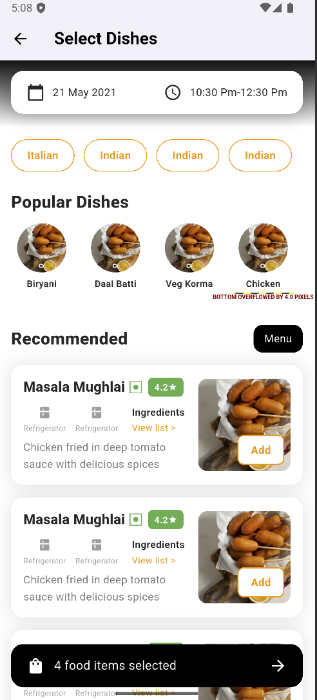
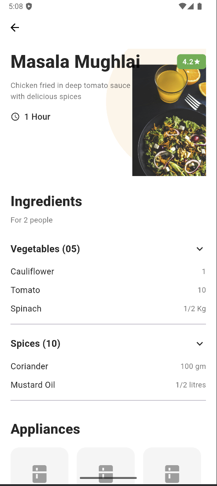

# ChefKart Flutter Assignment

A Flutter application built as part of the **ChefKart Flutter Developer Internship Assignment**.  
The app consumes REST APIs to display popular and recommended dishes, supports add-to-cart functionality, and follows the provided UI design closely.

---

## 🚀 Features

- Fetch dishes dynamically from REST API
- Popular dishes carousel
- Recommended dishes list
- Dish detail screen with ingredients & appliances
- Dynamic add-to-cart flow
- Clean, responsive UI matching the given design
- Error-safe API handling

---

## 📸 Screenshots

### Select Dishes Screen


### Dish Detail Screen


### Cart / Selection Preview


---

## 🛠 Tech Stack

- **Flutter**
- **Dart**
- **REST APIs**
- **Material UI**

---

## 🌐 API Endpoints Used

- All dishes  
  `https://8b648f3c-b624-4ceb-9e7b-8028b7df0ad0.mock.pstmn.io/dishes/v1/`

- Dish detail  
  `https://8b648f3c-b624-4ceb-9e7b-8028b7df0ad0.mock.pstmn.io/dishes/v1/{id}`

---

## ▶️ How to Run the Project

```bash
flutter pub get
flutter run
